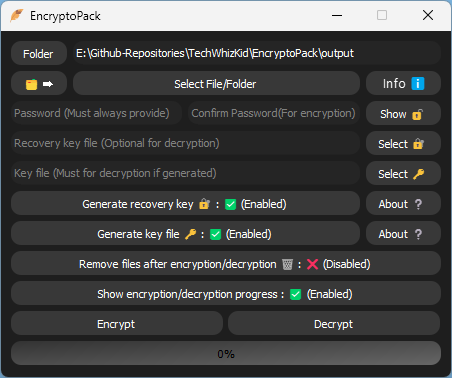
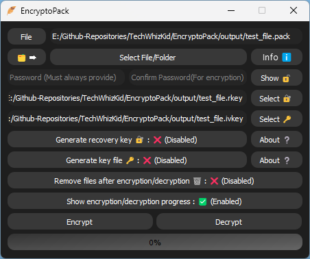

# EncryptoPack

**An intuitive application for securing files and folders through encryption.**

_Encryption is a process of transforming data into an unreadable form, so that only authorized parties can access it. Encryption helps protect your privacy and security by preventing unauthorized access, modification, or theft of your files and folders._

_EncryptoPack is a simple and user-friendly application that allows you to encrypt and decrypt your files and folders using AES-256 encryption, one of the most secure and widely used encryption algorithms._

---

## Features

- Encrypt files and folders using AES-256 encryption.
- Generate a recovery key in case you forget your password.
- Support a separate key file for extra security.

---

## Get Started

- To get started with **EncryptoPack**, you can clone the project using **Git**:

```bash
git clone --depth 1 https://github.com/TechWhizKid/EncryptoPack.git
```

- Next, install the required dependencies using **pip**:

```bash
pip install -r requirements.txt
```

- Or if you are on **Linux** or **MacOS**:

```bash
pip3 install -r requirements.txt
```

- You can also get the windows binary **[here](https://github.com/TechWhizKid/EncryptoPack/releases)**.

<ul><a href="https://github.com/TechWhizKid/EncryptoPack/releases/tag/v1.0"></a></ul>

---

<div align="center">

## Screenshots

<table>
  <tr>
    <th>
      
    </th>
    <th>
      
    </th>
  <tr>
</table>

</div>

---

